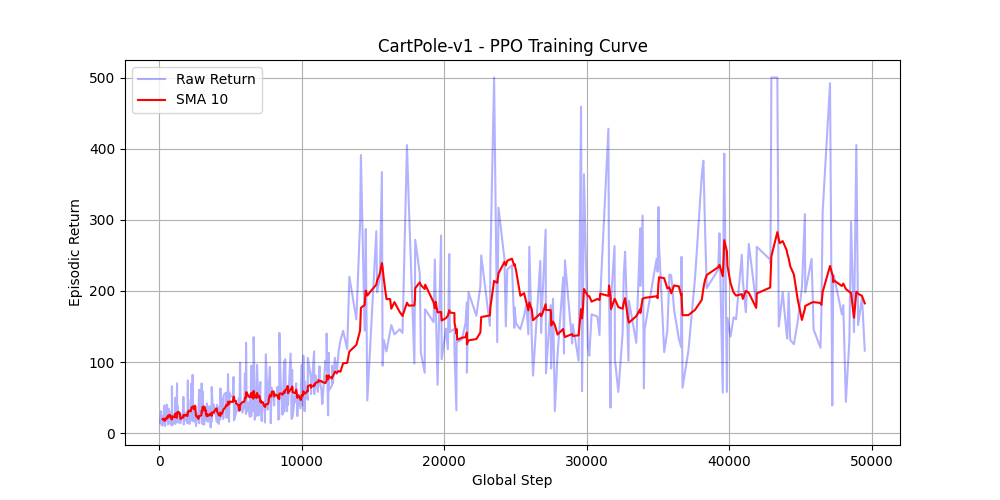

# Lesson 10 — PPO (Proximal Policy Optimization) with CleanRL

Single-file CleanRL-style PPO implementation for the *Reinforcement Learning* course
(MSc Artificial Intelligence, University of Verona). The agent adapts automatically to
discrete (`CartPole-v1`, default) and continuous (`Pendulum-v1`, `BipedalWalker-v3`, …)
action spaces using `gymnasium`.

## Topic & theory recap

PPO is an **on-policy**, actor–critic policy-gradient method that improves the policy
with small, stable steps:

- **Clipped surrogate objective.** Instead of the raw policy-gradient ratio
  `r(θ) = π_θ(a|s) / π_θold(a|s)`, PPO optimises
  `L = E[ min( r·A, clip(r, 1−ε, 1+ε)·A ) ]`.
  The clip (ε = `clip_coef`, 0.2) removes the incentive to move the policy too far in a
  single update, giving the stability of trust-region methods without the second-order math.
- **Generalized Advantage Estimation (GAE).** Advantages `A` are computed with an
  exponentially-weighted sum of TD residuals (`gamma`=0.99, `gae_lambda`=0.95), trading
  off bias and variance in the advantage signal.
- **On-policy rollouts.** Data is collected with the *current* policy across `num_envs`
  parallel environments (`num_steps` each), then reused for only `update_epochs` epochs
  of minibatch SGD before being discarded — no replay buffer.
- **Combined loss.** Total loss = clipped policy loss + `vf_coef`·value loss
  − `ent_coef`·entropy bonus. The value loss is optionally clipped the same way as the
  policy; the entropy bonus encourages exploration.

## Files

```
lessons/
  lesson10_cleanRL_ppo_train_code.py   # PPO training script (algorithm + learning-curve plot)
  lesson10_cleanRL_test.py             # loads a saved model and renders one greedy episode
  lesson10_cleanRL_ppo_run_train.sh    # bash runner (loops over an env list, calls the train script)
  lesson10_cleanRL_ppo_run_train.bat   # Windows runner for training
  lesson10_cleanRL_run_test.sh         # bash runner for the test script
  lesson10_cleanRL_run_test.bat        # Windows runner for the test script
results/
  ppo_learning_curve.png               # learning curve from the run documented below
  lesson10_results.txt                 # full console log of that run
```

## How to run

Trained and verified with the project venv (numpy 1.26, torch 2.8,
gymnasium 1.1.1, CPU — no CUDA on this machine, the script falls back automatically).
Run **from the `lessons/` directory**:

```bash
cd lessons
python lesson10_cleanRL_ppo_train_code.py --total-timesteps 50000
```

Key args: `--env-id` (default `CartPole-v1`), `--total-timesteps`, `--num-envs` (4),
`--learning-rate` (2.5e-4), `--cuda` (auto-falls back to CPU). The `.sh`/`.bat` runners
do the same over an environment list.

To replay a trained policy (writes its model to `runs/<run_name>/…cleanrl_model`):

```bash
python lesson10_cleanRL_test.py --env-id CartPole-v1 \
  --model-path runs/<run_name>/lesson10_cleanRL_ppo_train_code.cleanrl_model
```

## Expected results

The documented run is **CartPole-v1, 50 000 timesteps** (reduced from the 100 000 default
to keep wall-clock to a few seconds on CPU; learning is fully visible at 50k).



- The episodic return climbs from ~20 (random policy) and the 10-episode moving average
  settles around **~200**, with individual episodes repeatedly hitting the **500** cap
  (CartPole's maximum) in the second half of training.
- The 100-episode rolling mean printed at the end is ~204; it is dragged down by the very
  short early episodes still inside the 100-episode window, so it understates the
  near-converged policy — the curve and the recurrent 500-return episodes are the better
  indicator that the agent has solved the task.

Full console log: [`results/lesson10_results.txt`](results/lesson10_results.txt).

## Implementation notes (changes made to run on the installed stack)

- Filled in the two algorithm placeholders: the **clipped surrogate policy loss** and the
  **(optionally clipped) value loss** — standard CleanRL formulation, commented inline.
- Forced the **`Agg`** matplotlib backend (headless) and added a copy of the learning
  curve into `results/ppo_learning_curve.png`.
- No change needed for gym→gymnasium (already `import gymnasium as gym`, 5-tuple step,
  `info["episode"]`/`info["_episode"]` vector-stats path that gymnasium 1.x produces) or
  for CPU fallback (`device = "cuda" if torch.cuda.is_available() and args.cuda else "cpu"`).
