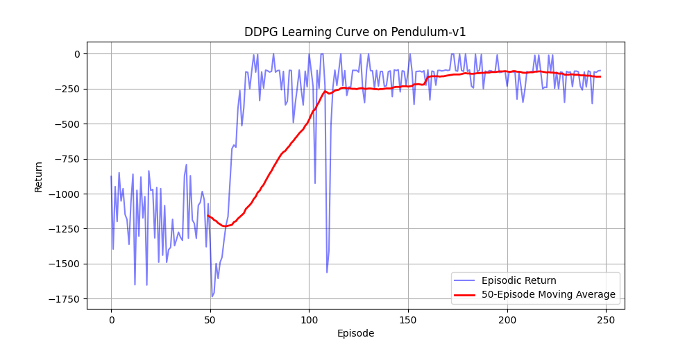

# Lesson 11 — DDPG (Deep Deterministic Policy Gradient) with CleanRL

Single-file CleanRL-style DDPG implementation for the *Reinforcement Learning* course
(MSc Artificial Intelligence, University of Verona). Default environment is the continuous
`Pendulum-v1` (also runs on `MountainCarContinuous-v0`, `BipedalWalker-v3`, …).

## Topic & theory recap

DDPG is an **off-policy**, actor–critic algorithm for **continuous** action spaces — think
of it as DQN extended to a deterministic continuous policy:

- **Deterministic policy gradient.** The actor `μ_θ(s)` outputs a single action (no
  distribution). It is trained by pushing actions toward higher critic values, i.e.
  maximising `Q_φ(s, μ_θ(s))` → minimising `−Q_φ(s, μ_θ(s))`. Gradients flow through the
  critic into the actor (chain rule), which is the deterministic policy gradient.
- **Critic (Q-network) + Bellman target.** The critic regresses
  `Q_φ(s,a)` onto `y = r + γ(1−done)·Q_φ'(s', μ_θ'(s'))` via MSE. Using the *target*
  networks for `y` keeps the regression target stable.
- **Replay buffer.** Transitions `(s, a, r, s', done)` are stored and sampled in random
  minibatches (off-policy), which decorrelates samples and reuses experience efficiently.
- **Target networks + Polyak averaging.** Slowly-tracking copies `μ_θ'`, `Q_φ'` are updated
  softly each step: `θ' ← τ·θ + (1−τ)·θ'` (τ = `tau` = 0.005). This prevents the moving-target
  instability of bootstrapped TD learning.
- **Exploration noise.** Because the policy is deterministic, exploration is injected by
  adding Gaussian noise (`exploration_noise` = 0.1, scaled by the action range) to actions
  during data collection; the first `learning_starts` steps use purely random actions to
  seed the buffer.

## Files

```
lessons/lesson11/
  lesson11_cleanRL_ddpg_train_code.py  # DDPG training script (algorithm + learning-curve plot)
  lesson11_cleanRL_test.py             # loads a saved actor and renders one greedy episode
  lesson11_cleanRL_run_train.sh        # bash runner (loops over an env list, calls the train script)
  lesson11_cleanRL_run_train.bat       # Windows runner for training
  lesson11_cleanRL_run_test.sh         # bash runner for the test script
  lesson11_cleanRL_run_test.bat        # Windows runner for the test script
  requirements.txt                     # pinned dependencies
results/
  ddpg_learning_curve.png              # learning curve from the run documented below
  lesson11_results.txt                 # full console log of that run
```

## How to run

Trained and verified with the project venv (numpy 1.26, torch 2.8,
gymnasium 1.1.1, CPU — no CUDA on this machine, the script falls back automatically).
Run **from the `lessons/lesson11/` directory**:

```bash
cd lessons/lesson11
python lesson11_cleanRL_ddpg_train_code.py \
  --total-timesteps 50000 --learning-starts 10000
```

Key args: `--env-id` (default `Pendulum-v1`), `--total-timesteps` (50000), `--learning-starts`
(see note below), `--buffer-size` (1e6), `--batch-size` (256), `--tau` (0.005),
`--exploration-noise` (0.1), `--learning-rate` (3e-4).

> **Note on `learning_starts`.** The script default is `25000`, i.e. half of a 50k-step run
> spent on pure random exploration, which leaves little budget for visible learning. The
> documented run lowers it to **`10000`** so the learning phase fills most of the curve.
> The algorithm and all other hyperparameters are unchanged.

To replay a trained actor (saved to `models/ddpg_<env>_actor.pth`):

```bash
python lesson11_cleanRL_test.py --env-id Pendulum-v1 \
  --model-path models/ddpg_Pendulum-v1_actor.pth
```

## Expected results

The documented run is **Pendulum-v1, 50 000 timesteps, `learning_starts=10000`** (CPU,
~3 minutes).



- During the random-action phase (first ~50 episodes) the return oscillates wildly around
  **−1000 to −1500**. Once updates begin, the 50-episode moving average climbs sharply and
  converges to roughly **−130 to −165**.
- Peak single-episode return reached **−0.21** (essentially a perfectly balanced pendulum),
  best 50-episode average **≈ −124**, final 50-episode average **≈ −163** — for Pendulum,
  whose reward is strongly negative for a swinging pole and near-zero for an upright one,
  this is a well-solved policy.

Full console log: [`results/lesson11_results.txt`](results/lesson11_results.txt).

## Implementation notes (changes made to run on the installed stack)

- Filled in the three algorithm placeholders: the **critic Bellman/MSE update**, the
  **deterministic-policy-gradient actor update**, and the **Polyak (soft) target-network
  update** — standard CleanRL formulation, commented inline.
- Forced the **`Agg`** matplotlib backend (headless) and added a copy of the learning
  curve into `results/ddpg_learning_curve.png`.
- No change needed for gym→gymnasium (already `import gymnasium as gym`, 5-tuple step) or
  CPU fallback. Under gymnasium 1.1.1's `NEXT_STEP` autoreset, the truncating step returns
  the true terminal observation and an empty `info`, so the existing `final_observation`
  guard simply never fires and the bootstrap target stays correct for Pendulum.
